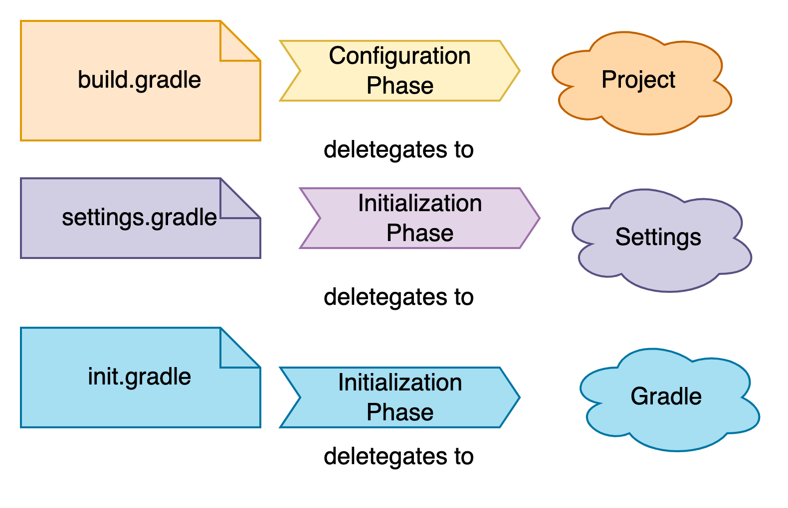

# Test Driven Development

## What

`Project Organization`

It is a gradle based project, following the standard layout of kotlin,

`About Gradle in Nutshell`

* Script <Interface>
>All file ending with `.gradle`. Implemented in every gradle script. Build script life cycle. How to access log property
>According to [Script Interface](https://docs.gradle.org/current/javadoc/org/gradle/api/Script.html), `Script` object has delegate object attached to it
>Build script has `Project` object

* Project <Interface>
> build.gradle
Access the method in the build `Script`
```kotlin
logger.info("This is the starting of the build script")
apply {
    println("hello from ${rootProject.name} ")

}
println("This is in ${file(".")}")
//println("File tree ${fileTree(".")}")
println("File tree ${fileTree("src").asFileTree}")

```
* Gradle <Interface>
* Settings <Interface>
* Task <Interface>
* Action <Interface>

## Gradle Life Cycle Phases
* Initialization

which project to execute, setting environment
map to one or more, *.gradle file
> First `init.gradle`
> `settings.gradle` to handle multi project. Which project to include in the build

Requires: build.gradle
* Configuration

Configure the project, requires `build.gradle`. Delegate object `Project`

* Execution

execution relies on build.gradle



## Use Case


`TDD approach`

We should stop at some point at early phase of dev,
to not continue with in implementation but write unit test

