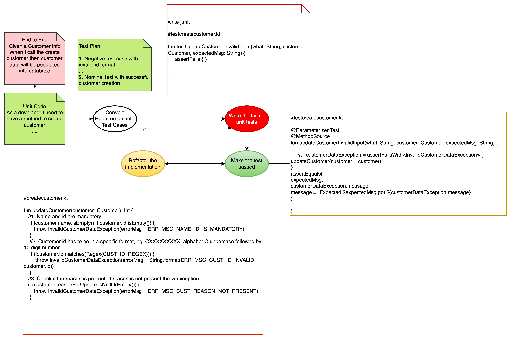

# Test Driven Development

## What

`Project Organization`

It is a gradle based project, following the standard layout of kotlin,

`About Gradle in Nutshell`

* Script <Interface>
>All file ending with `.gradle`. Implemented in every gradle script. Build script life cycle. How to access log property
>According to [Script Interface](https://docs.gradle.org/current/javadoc/org/gradle/api/Script.html), `Script` object has delegate object attached to it
>Build script has `Project` object

* Project <Interface>
> build.gradle
Access the method in the build `Script`
```kotlin
logger.info("This is the starting of the build script")
apply {
    println("hello from ${rootProject.name} ")

}
println("This is in ${file(".")}")
//println("File tree ${fileTree(".")}")
println("File tree ${fileTree("src").asFileTree}")

```
* Gradle <Interface>
* Settings <Interface>
* Task <Interface>
* Action <Interface>

## Gradle Life Cycle Phases
* Initialization

which project to execute, setting environment
map to one or more, *.gradle file
> First `init.gradle`
> `settings.gradle` to handle multi project. Which project to include in the build

Requires: build.gradle
* Configuration

Configure the project, requires `build.gradle`. Delegate object `Project`

* Execution

execution relies on build.gradle


## Use Case


`TDD approach`

We should stop at some point at early phase of dev,
to not continue with in implementation but write unit test



* Convert the requirement into unit test

Typical JIRA User story description regarding a feature look like this,
```text
Given a customer with id does not exists in the system
 
When a client add this customer to the system

Then the new record is created for this customer
```


```kotlin
class TestAddCustomerCommand {


    /**
     * This is the negative scenario with invalid input
     * Create a customer object with empty name
     * Call the addCustomer function
     * It should respond with exception and an error message accordingly
     * There are several possible negative scenarios pertaining to the
     * invalid input. eg. missing name, missing id, missing both id and name
     */
    @ParameterizedTest(name = "{0} with argument {1}")
    @MethodSource
    fun testAddCustomerInvalidInput(testLabel: String, customer: Customer, expectedMessage: String) {
        

    }

    /**
     * This is the negative test cases where the customer with the same id
     * exists in database. The exception is thrown by the PersistenceManager layer
     * since it has direct access to database.
     */
    @Test
    fun testAddCustomerWithDuplicateEntry() {
        
    }

    /**
     * This is the nominal test cases
     *
     */
    @Test
    fun testAddCustomerNominalCase() {
        
    }
}
```
* Write the failing test cases
* Make the test passed
